Got it 👍 I’ll give you a **refined and professional version** of your README with all the improvements I suggested. Here’s the updated version:

---

# Trendora

Trendora is a full-stack eCommerce web application built to provide a seamless online shopping experience. It was developed to practice modern MERN stack development, including backend APIs, frontend interactivity, and cloud integrations. Trendora allows users to browse products, add them to a cart, checkout securely, and track their orders, all in a responsive and user-friendly interface.

## 🚀 Live Demo

[Click here to try Trendora](https://trendora-i8b9.vercel.app/)

---

## 📑 Table of Contents

- [Features](#features)
- [Technologies Used](#technologies-used)
- [Installation & Setup](#installation--setup)
- [Environment Variables](#environment-variables)
- [Folder Structure](#folder-structure)
- [Screenshots](#screenshots)
- [Future Improvements](#future-improvements)
- [Contributing](#contributing)
- [License](#license)

---

## Features

- 🔐 User authentication and profile management
- 🛍️ Product catalog with search and filtering
- 🛒 Shopping cart and secure checkout
- 📦 Order history and tracking
- 📱 Responsive design for all devices
- ⭐ User reviews & ratings
- ☁️ Cloud image uploads with Cloudinary
- 🛠️ Admin dashboard (Product management & stock updates)

---

Got it 👍 Here’s an improved version of your **Technologies Used** section with better formatting, grouping, and badges (makes it more professional and eye-catching for recruiters):

---

## 🛠️ Technologies Used

### 🌐 Frontend

- ⚛️ **React.js** – Component-based UI library
- 🎨 **Tailwind CSS** – Utility-first CSS framework
- 🗂️ **Zustand** – Lightweight state management
- 📋 **React Hook Form** – Form validation & handling
- 🔔 **React Toastify** – Notifications
- 🎭 **React Icons** – Icon library

### 🖥️ Backend

- 🟢 **Node.js** – JavaScript runtime environment
- 🚂 **Express.js** – Web framework for Node.js
- 🍃 **MongoDB** – NoSQL database
- 📦 **Mongoose** – ODM for MongoDB
- 🔑 **JWT (JSON Web Token)** – Authentication & authorization
- 🔒 **Bcrypt** – Password hashing
- ☁️ **Cloudinary** – Image storage & CDN
- 📂 **Multer** – File upload middleware
- 📑 **CSV-Parser** – Bulk product import
- 💳 **Razorpay** – Payment gateway integration

---

## Installation & Setup

### Clone the repository:

```bash
git clone https://github.com/abhay395/Trendora.git
cd Trendora
```

### Backend Setup:

```bash
cd server
npm install
npm run start
```

### Frontend Setup:

```bash
cd client
npm install
npm run dev
```

Your app should now be running on:

- Frontend → [http://localhost:5173](http://localhost:5173)
- Backend → [http://localhost:3000](http://localhost:3000)

---

## Environment Variables

Create a `.env` file in both `server` and `client` directories.

**Server**

```
JWT_SECRET='Your token'
JWT_SECRET_KEY=SECRET_KEY
MONGODB_URL="Your mongodb URL"
PORT=3000
#* RazorPay Secret
RAZORPAY_KEY_ID = "Your RazorPay id"
RAZORPAY_KEY_SECRET = "Your RazorPay KEY_SECRET"

#* Cloundinary secrete
CLOUD_NAME = "Your cloud name"
CLOUD_API_KEY="Cloud Api key"
CLOUD_API_SECRET = "Cloud Api secret"
```

**Client**

```
VITE_API_URL= http://localhost:3000/api/v1
```

---

## Folder Structure

```
Trendora/
├── client/                      # React frontend
│   ├── public/                  # Static assets (index.html, favicon, etc.)
│   ├── src/
│   │   ├── api/                 # API call functions (productApi.js, userApi.js)
│   │   ├── assets/              # Images, icons, fonts
│   │   ├── components/          # Reusable UI components (Navbar, Buttons, ProductCard)
│   │   ├── pages/               # Page-level components (Home, Product, Cart, Checkout)
│   │   ├── store/               # Zustand global state management
│   │   ├── hooks/               # Custom React hooks
│   │   ├── utils/               # Helper functions (formatters, validators)
│   │   ├── App.jsx              # Main app component
│   │   ├── main.jsx             # Entry point for React DOM rendering
│   │   └── RootLayout.jsx       # Layout wrapper for pages
│   ├── .env                     # Environment variables for frontend
│   └── package.json
├── server/                      # Node.js & Express backend
│   ├── db/                      # For connect Databasse
│   ├── controllers/             # Request handlers for each route (productController.js, userController.js)
│   ├── models/                  # Mongoose schemas (Product.js, User.js, Order.js)
│   ├── routes/                  # Express routes (productRoutes.js, userRoutes.js)
│   ├── middleware/              # Middleware functions (auth.js, errorHandler.js)
│   ├── services/                # Business logic / helper services (paymentService.js, emailService.js)
│   ├── config/                  # Configuration files (db connection, cloudinary config)
│   ├── utils/                   # Utility functions (validators, token generation)
│   ├── uploads/                 # Temporary uploaded files (images via Multer)
│   ├── errors/                  # Custom error classes
│   └── index.js                 # Entry point for server
├── screenshots/                 # Screenshots for README or documentation
├── .gitignore                   # Git ignore file
└── README.md                    # Project documentation

```

---

## Screenshots

### Home Page 1

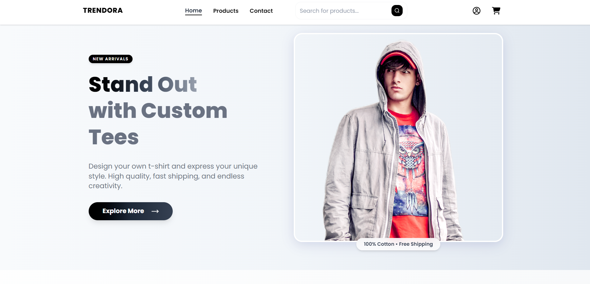

### Home Page 2

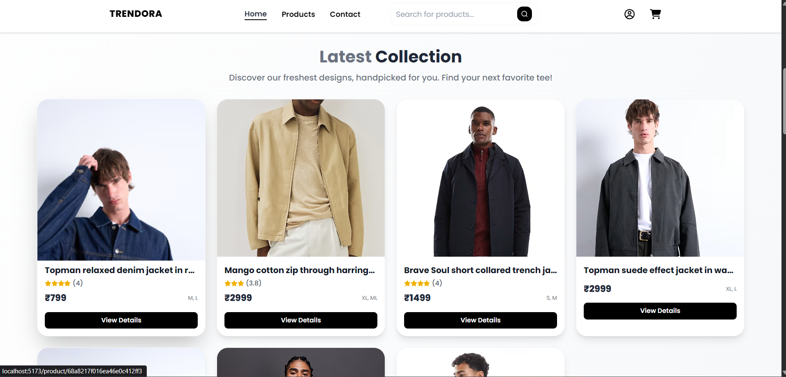

### Product Info

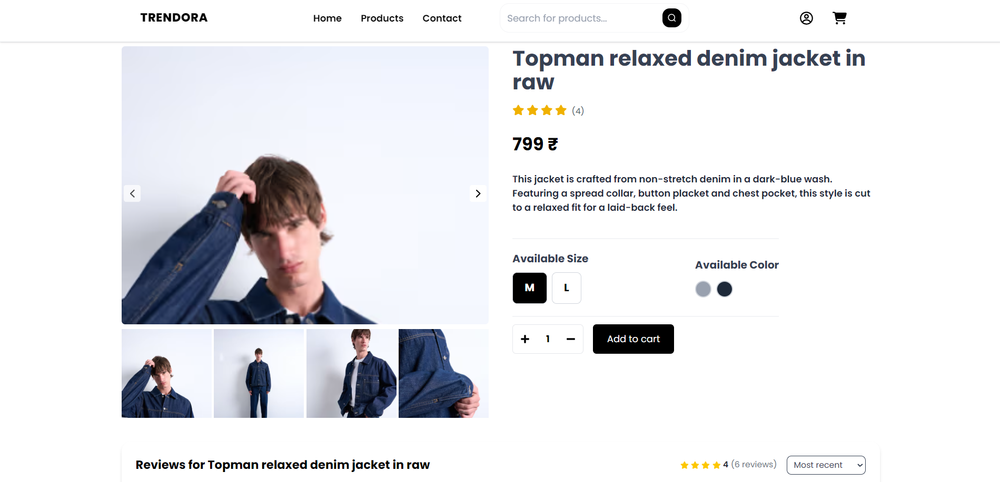

### Rating

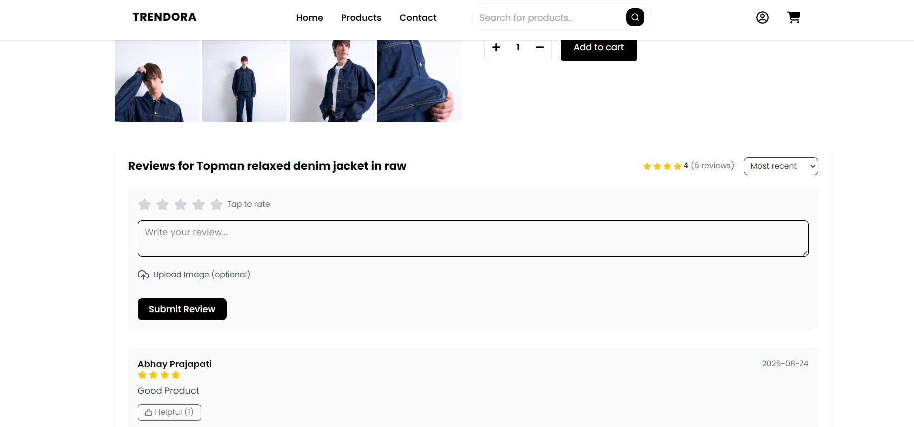

### Product List

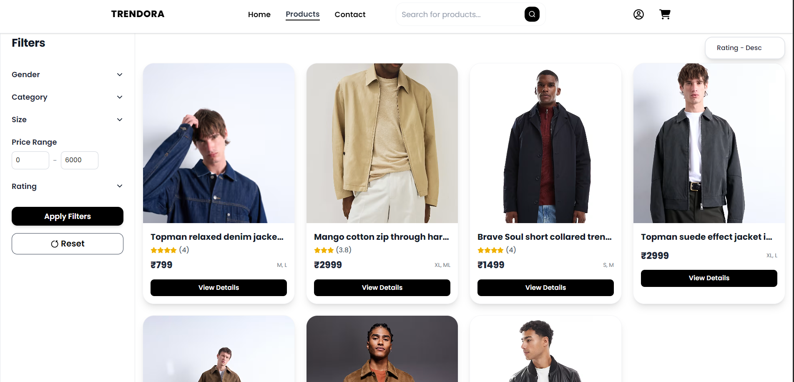

### Cart

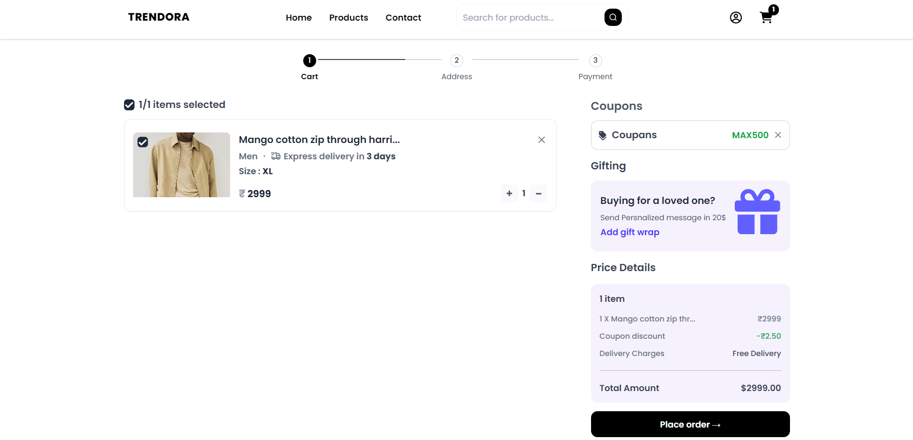

### Checkout

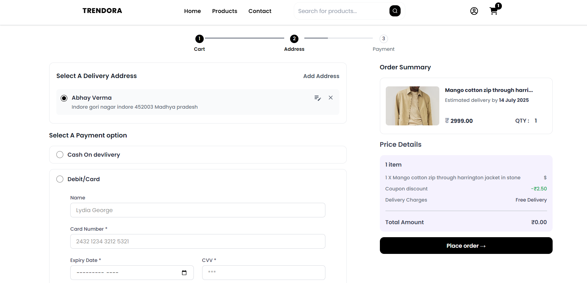

### Order Done

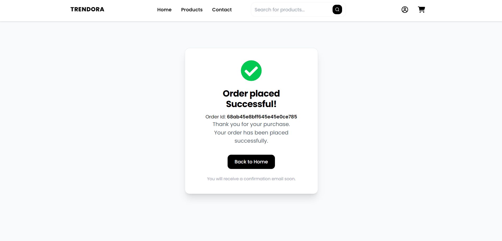

### Admin Dashboard

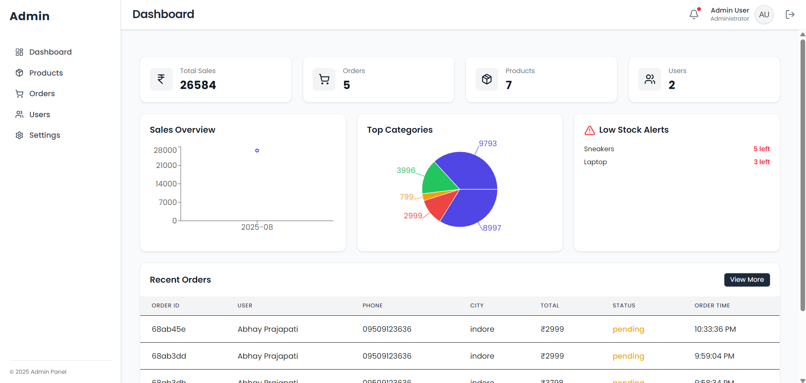

### Product in Admin Panel

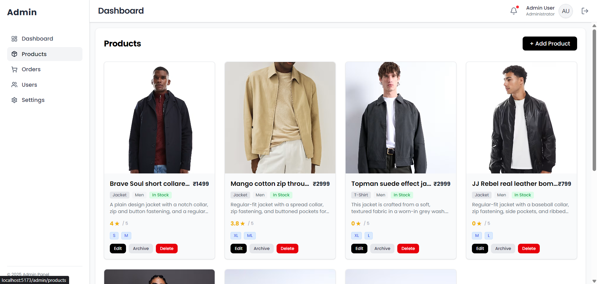

### Add Product

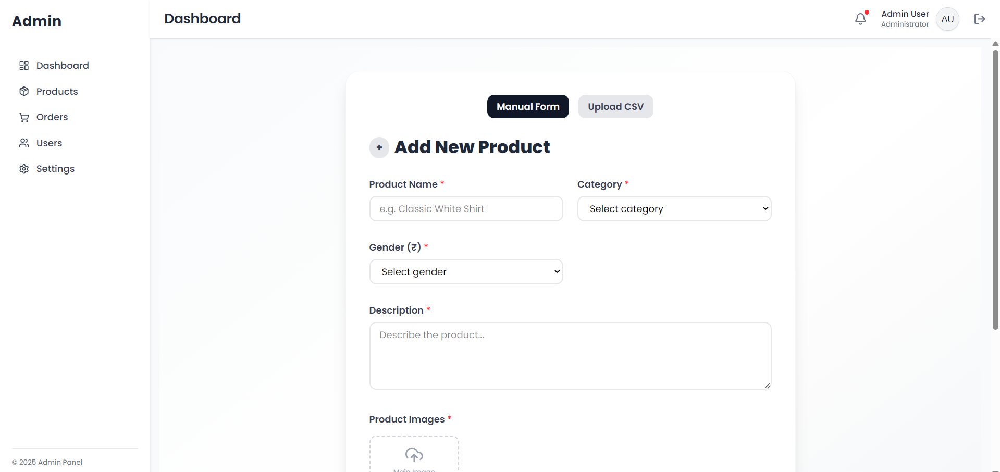

### Add Multiple Products


---

## 🔮 Future Improvements

- Add wishlist functionality
- Implement product recommendations system
- Improve admin analytics dashboard
- Add multi-language support

---

## 🤝 Contributing

Contributions are welcome!

- Fork the repo
- Create a new branch (`feature/your-feature`)
- Commit your changes
- Submit a pull request

---

## 📄 License

This project is licensed under the **MIT License**.

---
