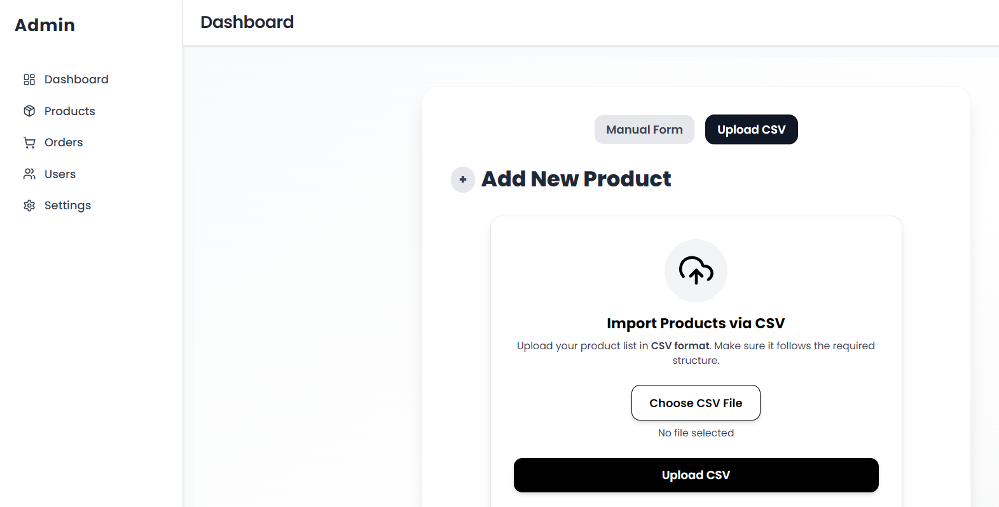

Got it 👍 I’ll give you a **refined and professional version** of your README with all the improvements I suggested. Here’s the updated version:

---

# Trendora

Trendora is a modern **eCommerce web application** designed to provide a seamless online shopping experience. Built with scalability and user-friendliness in mind, Trendora enables users to browse, search, and purchase products with ease.

## 🚀 Live Demo

[Click here to try Trendora](https://your-demo-link.com) *(Add your deployed link here if available)*

---

## 📑 Table of Contents

* [Features](#features)
* [Technologies Used](#technologies-used)
* [Installation & Setup](#installation--setup)
* [Environment Variables](#environment-variables)
* [Folder Structure](#folder-structure)
* [Screenshots](#screenshots)
* [Future Improvements](#future-improvements)
* [Contributing](#contributing)
* [License](#license)

---

##  Features

* 🔐 User authentication and profile management
* 🛍️ Product catalog with search and filtering
* 🛒 Shopping cart and secure checkout
* 📦 Order history and tracking
* 📱 Responsive design for all devices
* ⭐ User reviews & ratings
* ☁️ Cloud image uploads with Cloudinary
* 🛠️ Admin dashboard (Product management & stock updates)

---

##  Technologies Used

**Frontend**: React, Tailwind CSS, Zustand, React-Hook-Form, React-Icons, React-Toastify

**Backend**: Node.js, Express.js, MongoDB, Mongoose, Cloudinary, Bcrypt, JSON Web Token, CSV-Parser, Multer, Razorpay

---

##  Installation & Setup

### Clone the repository:

```bash
git clone https://github.com/abhay395/Trendora.git
cd Trendora
```

### Backend Setup:

```bash
cd server
npm install
npm run start
```

### Frontend Setup:

```bash
cd client
npm install
npm run dev
```

Your app should now be running on:

* Frontend → [http://localhost:5173](http://localhost:5173)
* Backend → [http://localhost:3000](http://localhost:3000)

---

##  Environment Variables

Create a `.env` file in both `server` and `client` directories.

**Server**

```
MONGO_URI=
JWT_SECRET=
CLOUDINARY_NAME=
CLOUDINARY_API_KEY=
CLOUDINARY_API_SECRET=
RAZORPAY_KEY_ID=
RAZORPAY_KEY_SECRET=
```

**Client**

```
VITE_API_URL=
VITE_RAZORPAY_KEY_ID=
```

---

##  Folder Structure

```
Trendora/
├── client/        # React frontend
├── server/        # Node.js backend
├── screenshots/   # Project screenshots
└── README.md
```

---

##  Screenshots

### Home Page 1


### Home Page 2


### Product Info


### Rating


### Product List


### Cart


### Checkout


### Order Done


### Admin Dashboard


### Product in Admin Panel


### Add Product


### Add Multiple Products



---

## 🔮 Future Improvements

* Add wishlist functionality
* Implement product recommendations system
* Improve admin analytics dashboard
* Add multi-language support

---

## 🤝 Contributing

Contributions are welcome!

* Fork the repo
* Create a new branch (`feature/your-feature`)
* Commit your changes
* Submit a pull request

---

## 📄 License

This project is licensed under the **MIT License**.

---
